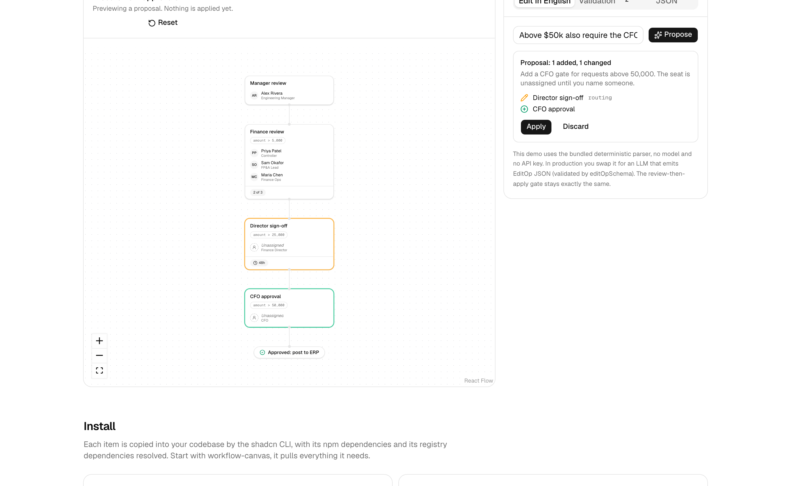

<div align="center">

# approvals-ui

**The approval workflow screen, as shadcn-style components for [React Flow](https://reactflow.dev).**
Quorum gates, amount thresholds, a policy lint that knows what segregation of duties means,
and plain-language editing where a human reviews the diff before anything lands.

### ▶︎ [Live playground](https://approvals-ui.vercel.app)

</div>



```bash
npx shadcn@latest add https://approvals-ui.vercel.app/r/workflow-canvas.json
```

One command. The code lands in your project, with its dependencies resolved. It is yours to edit.

## Why this exists

React Flow gives you a canvas. [React Flow UI](https://reactflow.dev/ui) gives you generic
workflow chrome. But an approval workflow is not a generic graph: it has approvers who can be
unassigned, gates that need 2 of 3 signatures, thresholds that route a $60k request differently
from a $600 one, and rules a reviewer expects the screen to enforce, like nobody approving twice
on the same path.

Every procurement, AP, expense, or access-request product rebuilds this exact screen. This
registry is that screen, extracted from a real one: [ledgerloop](https://ledgerloop-eta.vercel.app),
where an agent derives the approval workflow from a client's HRIS and the user maintains it in
plain language.

## What you get

| Item | What it is |
| --- | --- |
| `workflow-canvas` | Policy JSON in, laid-out graph out. Auto-layout on real node sizes via [react-flow-auto-layout](https://www.npmjs.com/package/react-flow-auto-layout), diff and status overlays, click-to-select, pan-to-focus. |
| `approval-node` | The gate card: approvers, unassigned seats, quorum badge, condition pill, SLA, diff and issue rings. |
| `terminal-node` | Approved and rejected outcome pills. |
| `validation-panel` | The policy lint, rendered. Click an issue to focus the step on the canvas. |
| `nl-edit-panel` | Plain-language edits behind a human gate: propose, review the diff, apply or discard. |
| `approvals-core` | The headless core alone: Zod policy schema, validation, step diff, deterministic edit ops. No React required. |

`workflow-canvas` pulls the nodes and the core with it. Add the panels if you want the full screen.

## The policy model

A policy is a DAG of steps. Execution enters at `roots`, follows `next` edges, and ends at
terminal steps. Every step carries a `when` guard; a step whose condition is false for a given
request is skipped. Conditions live on steps, not edges, so the graph stays legible and the
diff stays small.

```ts
import type { ApprovalPolicy } from "@/lib/approvals-ui/policy"

const policy: ApprovalPolicy = {
  name: "Procurement approvals",
  roots: ["manager-review"],
  steps: [
    {
      id: "manager-review",
      kind: "approval",
      label: "Manager review",
      when: { kind: "always" },
      approvers: [{ name: "Alex Rivera", title: "Engineering Manager" }],
      mode: "all",
      next: ["finance-review"],
    },
    {
      id: "finance-review",
      kind: "approval",
      label: "Finance review",
      when: { kind: "leaf", field: "amount", op: ">", value: 5_000 },
      approvers: [
        { name: "Priya Patel", title: "Controller" },
        { name: "Sam Okafor", title: "FP&A Lead" },
        { name: "Maria Chen", title: "Finance Ops" },
      ],
      mode: "quorum",
      quorum: 2,
      next: ["approved"],
    },
    {
      id: "approved",
      kind: "terminal",
      label: "Approved: post to ERP",
      when: { kind: "always" },
      outcome: "approved",
      next: [],
    },
  ],
}
```

Render it:

```tsx
import { WorkflowCanvas } from "@/components/approvals-ui/workflow-canvas"

<div className="h-[600px]">
  <WorkflowCanvas policy={policy} issues={validatePolicy(policy)} />
</div>
```

## The policy lint

`validatePolicy` runs deterministic rules in two severities. Errors mean the graph is broken
and should block activation. Warnings mean it works but breaks an approval best practice, so a
human should look.

**Errors:** `duplicate-step-id` · `dangling-edge` · `no-roots` · `unknown-root` · `cycle` ·
`unreachable-step` · `no-terminal` · `no-approved-terminal` · `approved-terminal-unreachable` ·
`quorum-invalid`

**Warnings:** `unresolved-approver` · `duplicate-gate` · `quorum-ignored` ·
`no-approval-before-terminal` · `single-approver-high-value` (a path above the materiality
threshold with fewer than two gates) · `segregation-of-duties` (the same person approving twice
on one path)

```ts
import { validatePolicy, isActivatable } from "@/lib/approvals-ui/validate"

const issues = validatePolicy(policy, { materiality: 25_000, amountField: "amount" })
if (isActivatable(issues)) activate(policy)
```

## Editing: ops, not regeneration

A proposer never rewrites the policy. It emits one small `EditOp` (`set-threshold`,
`add-approver`, `insert-approval-after`, `remove-step`, ...) and `applyEditOp` applies it
deterministically, copying everything unrelated verbatim. The diff you review is exactly what
the op touched. Two ops, `none` and `clarify`, let a proposer decline or ask instead of
guessing.

The playground ships with a deterministic demo parser, so the edit panel works with no model
and no API key. In production, swap it for an LLM:

```ts
import { generateObject } from "ai"
import { editOpSchema, proposeEdits, type Proposer } from "@/lib/approvals-ui/edit-ops"

const llmProposer: Proposer = async (instruction, policy) => {
  const { object: op } = await generateObject({
    model: "anthropic/claude-sonnet-5",
    schema: editOpSchema,
    prompt: `Policy: ${JSON.stringify(policy)}\nInstruction: ${instruction}\nEmit one EditOp.`,
  })
  return proposeEdits(policy, [op])
}
```

The `NlEditPanel` UI does not change. The human gate does not change either: the proposal is
rendered as a diff on the canvas, and nothing lands until Apply is clicked. If you are building
agents that touch approval chains, that review step is the point.

## Design decisions

- **Conditions are guards on steps, not edges.** Fewer objects to manage, smaller diffs, and
  the graph reads top to bottom like the policy document it replaces.
- **The lint is code, not a model.** Segregation of duties and single-approver-on-high-value
  are checked deterministically, the same way every run.
- **Edits are reviewable by construction.** Ops are small and typed, so the diff is always the
  full story of a change.
- **You own the code.** This is a registry, not a package. Fork the semantics where your
  domain disagrees.

## Development

```bash
pnpm install
pnpm dev          # playground on localhost:3000
pnpm test         # vitest: validation, diff, ops, demo parser
pnpm registry:build   # rebuild public/r/*.json from registry.json
```

## Credits

Built by [Dylan Mérigaud](https://www.linkedin.com/in/dylanmerigaud), freelance AI full-stack
engineer (ex-Pivot, procurement fintech). I build approval workflows, AP automation, and
production agent systems for fintech teams, on contract.

Extracted from [ledgerloop](https://ledgerloop-eta.vercel.app). Layout by
[react-flow-auto-layout](https://github.com/DylanMerigaud/react-flow-auto-layout). Built on
[React Flow](https://reactflow.dev) and [shadcn/ui](https://ui.shadcn.com).

MIT
